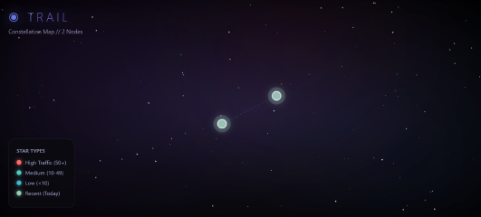

# TRAIL — Personal Browsing Visualizer

Transform your browsing history into an interactive constellation map.



## How to Use

1. **Install** — Load as unpacked extension in Chrome/Brave
2. **Browse** — Visit websites normally
3. **Visualize** — Click the TRAIL icon → "Open Constellation Map"
4. **Explore** — Drag nodes, zoom, see your browsing patterns

## Features

- 🌌 **Cosmic Interface** — Nebula backgrounds with 150+ animated stars
- ⭐ **Constellation Map** — D3.js force-directed graph
- 🔗 **Constellation Lines** — Connections between temporally-linked domains
- 🎨 **Color-Coded Stars** — Green=recent, Red=high traffic, Teal=medium, Blue=low
- 📊 **Info Panel** — Click any star to see domain stats & connections
- 🔍 **Interactive** — Zoom, pan, drag to explore your browsing galaxy

## Privacy

- ✅ All data stored locally in IndexedDB
- ✅ Zero external API calls
- ✅ No tracking or analytics
- ✅ Auto-purges after 30 days (configurable)

## Installation

```bash
# Clone
git clone https://github.com/CrazhHolmes/TRAIL-Extension.git

# Load in Chrome/Brave
# 1. Go to chrome://extensions
# 2. Enable Developer Mode
# 3. Click "Load unpacked"
# 4. Select the extension folder
```

## How It Works

1. **Background Script** — Captures URLs via chrome.history API
2. **Content Script** — Extracts page text using Readability.js
3. **Constellation** — Canvas-based visualization with physics
4. **All Local** — IndexedDB only, no server

## Built By

[Wizardrytezch](https://github.com/CrazhHolmes)

## License

MIT — Personal use welcome.
